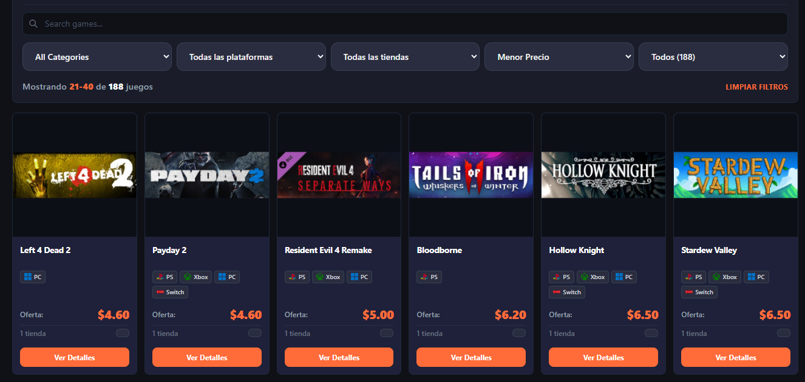

# 🕹️ Game Desk  
### Catálogo moderno de ofertas, precios y formatos de videojuegos


 



Game Desk es una aplicación web desarrollada con React, TypeScript y Vite que permite visualizar un catálogo organizado de videojuegos en oferta. 
El sistema muestra precios, descuentos, formato (físico o digital) e imágenes de cada juego, ofreciendo una interfaz clara, moderna y fácil de navegar. 
Este proyecto fue creado con fines académicos para demostrar el uso de tecnologías web modernas y buenas prácticas de desarrollo.


🚀 Objetivo del Proyecto

- Mostrar ofertas reales o simuladas de videojuegos en una aplicación web moderna.  
- Practicar desarrollo con **React**, componentes, estados y renderizado dinámico.  
- Utilizar herramientas del ecosistema moderno: React, TypeScript, Vite, Firebase (opcional).  


🧩 Tecnologías Utilizadas

### 🔹 Frontend  
- React  
- TypeScript  
- Vite  
- CSS3 / estilos personalizados  
- HTML 

### 🔹 Backend / Procesamiento  
- Scripts en la carpeta `backend/`  
- Procesamiento y limpieza de datos  
- Firebase Realtime Database (según implementación)

🔹 Otros  
- GitHub Pages / Firebase Hosting  
- Markdown para documentación  
- Archivos `.md` del equipo

---

## 📁 Estructura del Proyecto  
La siguiente estructura corresponde al contenido real de este repositorio:
```
game_desk/
│
├── .firebaserc
├── .gitignore
├── CHANGELOG_GAME_DESK.md
├── GUIA_VISUAL.md
├── IMPLEMENTACION_COMPLETADA.md
├── RESUMEN_FINAL.md
│
├── eslint.config.js
├── firebase.json
│
├── index.html # Punto de entrada básico para React
│
├── src/ # CÓDIGO PRINCIPAL (React)
│ ├── components/ # Componentes reutilizables
│ ├── pages/ # Páginas del proyecto
│ ├── assets/ # Imágenes / recursos
│ └── main.tsx # Entrada de React
│
├── backend/ # Scripts de scraping (según versión)
│
├── package.json # Dependencias (React, React-DOM, Vite, etc.)
├── package-lock.json
│
├── tsconfig.json
├── tsconfig.app.json
├── tsconfig.node.json
│
└── vite.config.ts # Configuración de Vite
```

🖥️ ¿Qué hace el proyecto?

- Muestra un catálogo de videojuegos con componentes de React.  
- Incluye imágenes, precios, descuentos y formato físico/digital.  
- Permite crecer con filtros, búsqueda o conexión a backend.  
- Usa React para renderizar los elementos dinámicamente.

---

## 🧾 PreRequisitos

- Node.js (versión 18+ recomendada)  
- NPM (incluido con Node.js)  
- Cuenta de Firebase (opcional, si se va a desplegar)

---

## 🔧 Instalación y Ejecución

### 1. Clonar el repositorio
```
git clone https://github.com/jimena-mejia/game_desk.git
cd game_desk
```

### 2. Instalar dependencias
```npm install```

### 3. Ejecutar en modo desarrollo
```npm run dev```

El proyecto abrirá en:  
```
👉 http://localhost:5173
```
---

## 📦 Crear build para producción

Los archivos optimizados se generan en la carpeta:
```
dist/
```
---

## 📡 Despliegue con Firebase (opcional)
```
npm install -g firebase-tools
firebase login
firebase init
firebase deploy
```


## 👥 Créditos

**Autor:** Britanny Alvarado, Jimena Mejía Víquez, Joan Cordero  
**Curso:** Arquitectura de Computadores  
**Profesor:** Jorge Alfaro Velasco  
**Institución:** Instituto Tecnológico de Costa Rica (TEC)  
**Año:** 2025

## 📄 Licencia
Este proyecto se distribuye exclusivamente con fines académicos y educativos.

